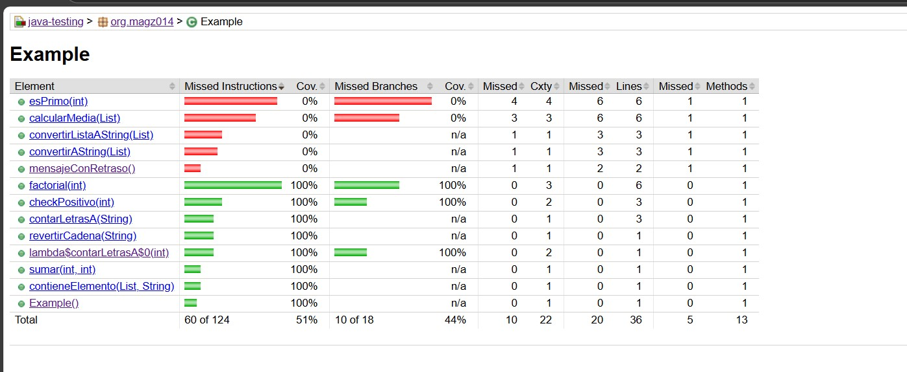
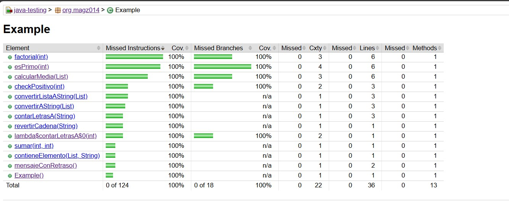

# Java Unit Testing + Jacoco Coverage

Este proyecto es un ejercicio práctico diseñado para familiarizarse con las **pruebas unitarias en Java utilizando JUnit 5** y la generación de reportes de cobertura con **JaCoCo**.

Contiene una clase `Example.java` con métodos variados que permiten practicar múltiples tipos de pruebas:

-  Validaciones booleanas
-  Manejo de excepciones
-  Operaciones sobre listas y cadenas
-  Algoritmos clásicos (factorial, número primo, media, etc.)

Además, se incluye configuración de **JaCoCo** en el `pom.xml` para:

- Generar reportes de cobertura automáticamente
- Establecer una cobertura mínima requerida de **85%** de líneas

---

##  Tecnologías utilizadas

- Java 21
- JUnit 5 (`junit-jupiter-api`)
- Jacoco Maven Plugin (`0.8.12`)
- Maven

---

##  Estructura del Proyecto

```
src/
├── main/
│   └── java/org/magz014/
│       └── Example.java       # Clase principal con los métodos a probar
└── test/
    └── java/org/magz014/
        └── ExampleTest.java   # Pruebas unitarias para la clase Example
```

## Métodos implementados
La clase Example contiene los siguientes métodos:

- sumar(int a, int b) - Suma dos números enteros

- checkPositivo(int numero) - Verifica si un número es positivo

- contarLetrasA(String cadena) - Cuenta las letras 'a' en una cadena

- contieneElemento(List<String>, String) - Verifica si una lista contiene un elemento

- revertirCadena(String) - Revierte una cadena

- factorial(int) - Calcula el factorial de un número

- esPrimo(int) - Verifica si un número es primo

- mensajeConRetraso() - Simula una operación con retraso

- convertirAString(List<Integer>) - Convierte una lista de enteros a strings

- calcularMedia(List<Integer>) - Calcula la media de una lista de números

- convertirListaAString(List<String>) - Convierte una lista de strings a un string concatenado







## Cobertura con JaCoCo
El proyecto está configurado para:
- Generar reporte de cobertura en `target/site/jacoco/`
- Requerir al menos 85% de cobertura de líneas
- Ejecutar la verificación durante el phase `test` de Maven

## 🚀 Cómo ejecutar

1. Clonar el repositorio
2. Ejecutar pruebas y generar reporte Jacoco:
   ```bash
   mvn clean test

## Créditos

Este proyecto está basado en el ejercicio mostrado en el canal [Un Programador Nace](https://youtube.com/@unprogramadornace).  
Gracias al creador por compartir contenido educativo de calidad.
Todo el crédito por la lógica original pertenece a su autor.